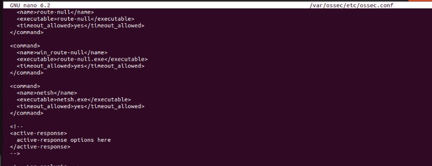

**SSH Brute Force Prevention on Windows with Wazuh.**

First, we make sure that we can ping the target device.

Installing the OpenSSH server if it is not already installed.

Then we need to change SyslogFacility to LOCAL0 (to only see the
information that we need) in the C:\\ProgramData\\ssh\\sshd_config file
for SSH logging into an additional log file, then restart the OpenSSH
server.

We can see logs in the C:\\ProgramData\\ssh\\logs\\sshd.log file.

Add this to the ossec.conf file on the agent to send logs to the Wazuh
server.

Changing our account to a local account for password login via SSH.

Create a custom decoder file for our sshd.log file. Don't forget to
write the decoder for invalid user attempts **above** the one for failed
attempts on existing users to prevent collisions.

To detect this type of log (which doesn\'t have a default decoder), we
must rely on a unique point (e.g., 2948 2025-05-06 19:16:27.337) and
write a regex for this. If this value is stable, you can just write this
value as a prematch and set it as the root (parent) decoder. After
testing the parent decoder, if we see a result, we then start writing
child decoders based on that result.

We have three situations:

- Accepted login

- Failed login with an invalid user

- Failed login for a valid user

Each time we write a child decoder, we reference the parent decoder and
then use regex to extract user, srcip, and srcport values.

use_own_name means that the decoder will hold its own name and not
inherit the parent decoder's name.

Why do we need to write invalid user attempts first? Because we use the
word Failed as a prematch for these logs, and the word Failed also
exists in invalid user attempts. Wazuh parses logs in order according to
decoder priority, so if invalid user attempts come after, they will be
ignored.

After these steps restart the wazuh-manager service. My decoder at the
end of documentation.

We can see our logs in the Wazuh manager.

Create custom rules to detect brute force attempts. You can copy the
default rules for Linux SSH on the Wazuh server, but you need to add a
few lines.\
First is decoded_as, which specifies which decoder the rule applies to.
Change the rule numbers as you wish.\
Additionally, you could add a section for brute force attempts with
valid users (Wazuh doesn't have this by default), because an attacker
might already know the username and start attacking.

After these steps restart the wazuh-manager service.

As you can see, our decoders and rules are working. You can test them
using the wazuh-logtest tool.

Alerts on Wazuh.

I use netsh to block the attacker's IP.

Add these lines to the ossec.conf file on the Wazuh manager and restart wazuh-manager service. It means
that if rule 100013 is triggered, then netsh will run using alert
credentials.

Install **Hydra** for brute force attack.

Starting the brute force attack.

And we can see that our attack was stopped because netsh blocked the IP.

Detailed logs in the Wazuh dashboard. We can also see the previous
related logs.

And the Active Response Alert.

**References:**

[[OpenSSH
logs]](https://superuser.com/questions/1635361/starting-openssh-server-in-windows-with-debug-messages-enabled-d)

[[Wazuh
decoders]](https://documentation.wazuh.com/current/user-manual/ruleset/decoders/index.html)
and [[decoder
syntax]](https://documentation.wazuh.com/current/user-manual/ruleset/ruleset-xml-syntax/decoders.html)

[[My decoder file on
Github]](https://github.com/ElshanGambarov/Wazuh_OpenSSH_decoder/blob/main/decoder-for-openssh.xml)

[[Custom Wazuh
Rules]](https://documentation.wazuh.com/current/user-manual/ruleset/rules/custom.html)

[[Wazuh Active
Response]](https://documentation.wazuh.com/current/user-manual/capabilities/active-response/index.html)
